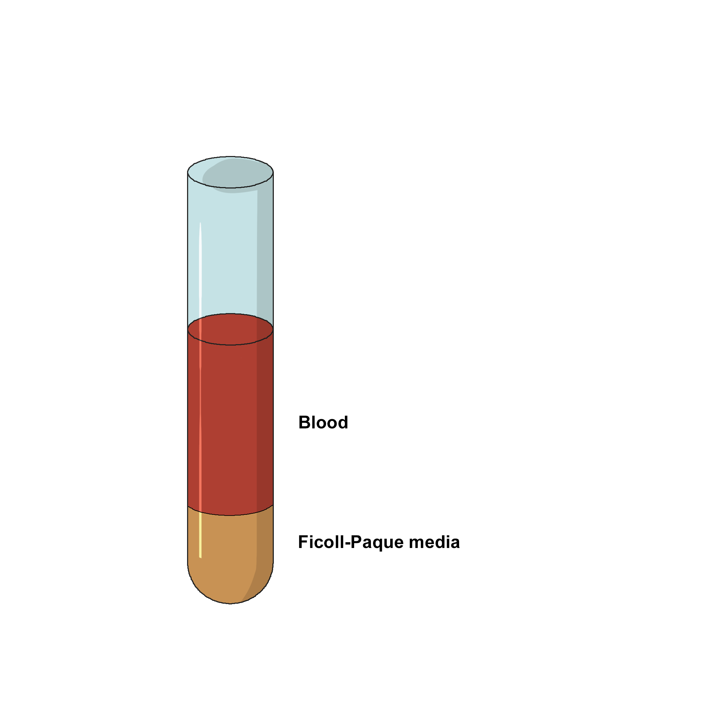
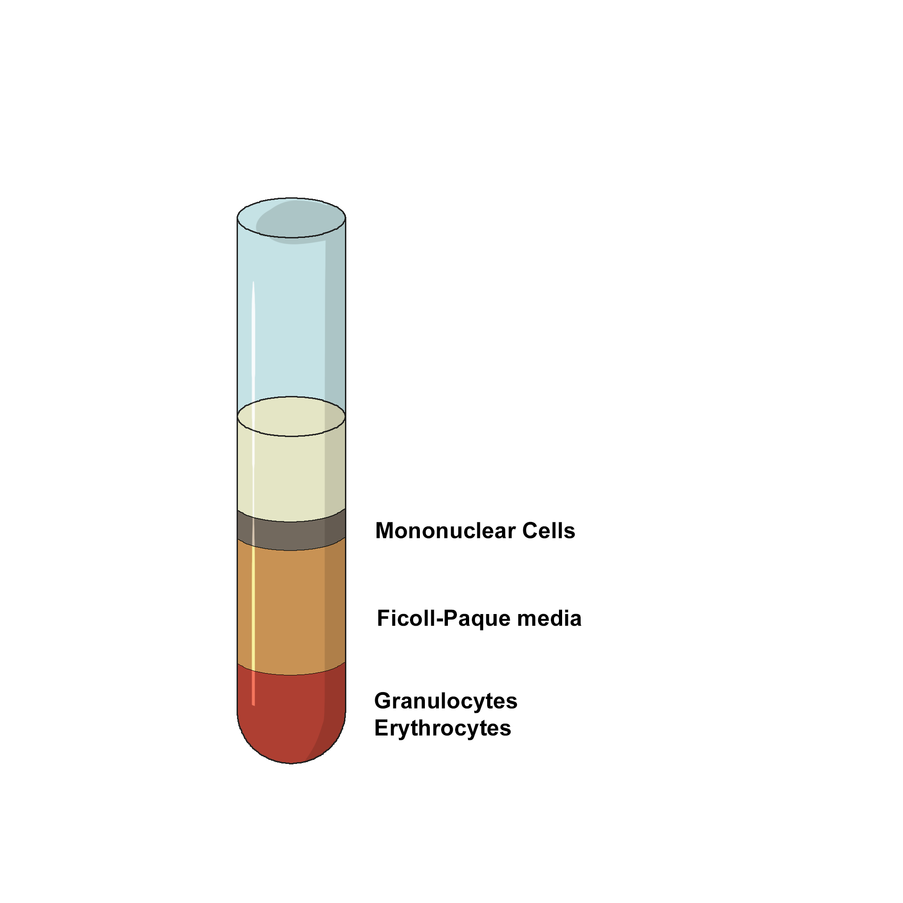
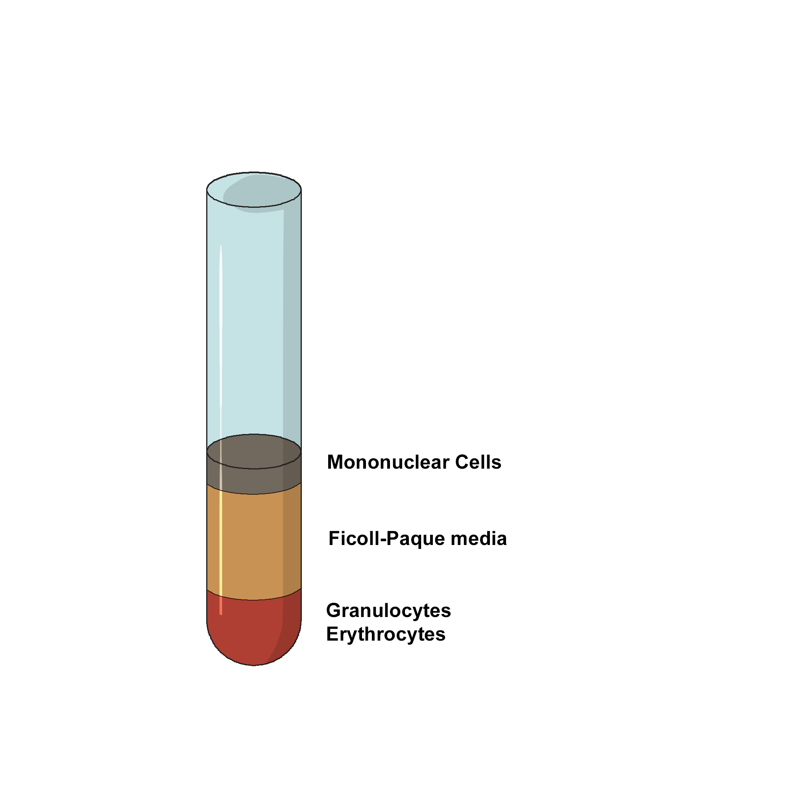
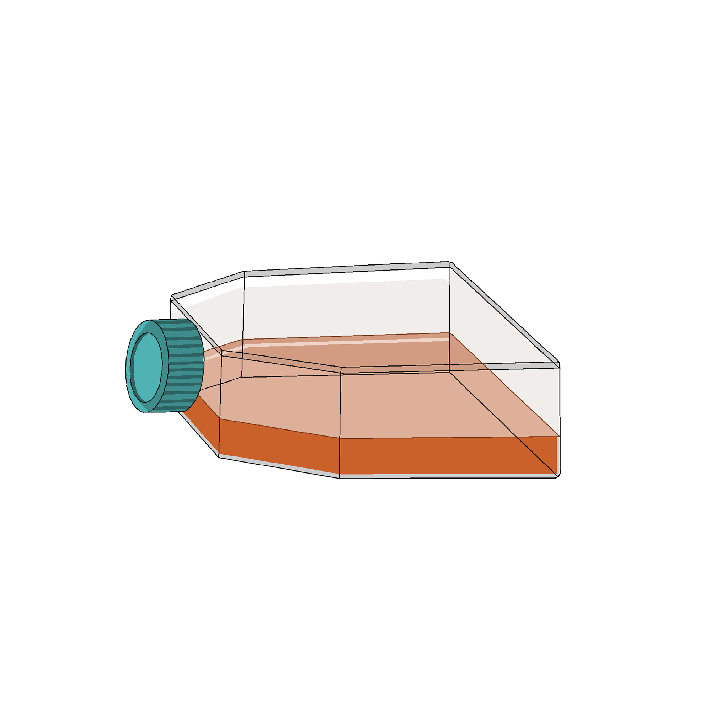
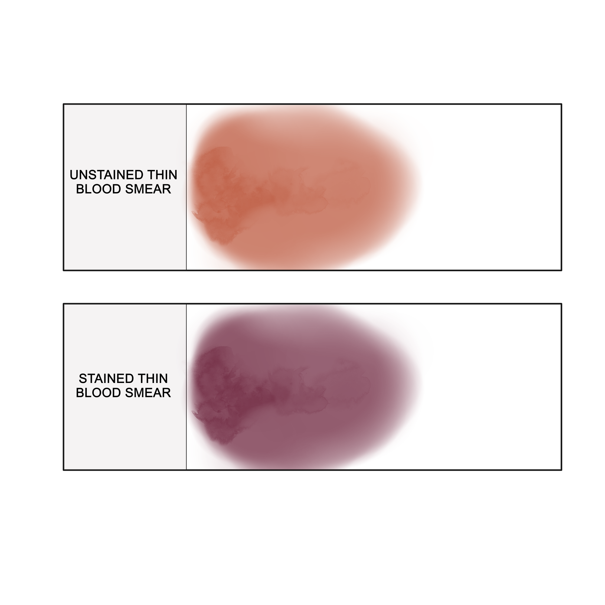

### Procedure :
 
The most common process for lymphocyte isolation is density gradient centrifugation. Whole blood can be collected in a sterile tube with EDTA to avoid coagulation. Further the whole blood can be fractionated into different components through differential centrifugation. Conventionally, a double discontinuous density gradient medium such as Ficoll-Hypaque is used for isolation of human blood lymphocytes. 

#### ISOLATION OF MONONUCLEAR CELLS 
* Dilute collected blood with equal volume of PBS buffer (phosphate-buffered saline) in a 10-15 mL centrifuge tube.
* Carefully overlay the diluted blood on the Ficoll-Hypaque without mixing.
 

* Centrifuge the blood-Ficoll-Hypaque solution for 30 minutes at low speed (1800 RPM/400 RCF) at 4ᴼC, to separate the cells according to their cellular density.
 

* Draw off the upper plasma layer using a clean pasteur pipette, leaving the mononuclear cell layer undisturbed at the interface.
 

* Transfer the Buffy coat layer to a sterile centrifuge tube using a sterile pasteur pipette.

#### WASHING LYMPHOCYTES

* Estimate the volume of the transferred mononuclear cells and add three volumes of PBS to the centrifuge tube.
* Suspend the cells by gently drawing them in and out of a pipette.
* Centrifuge at 400xG or 1800 RPM for 10-15 minutes at 4ᴼC.
* Discard the supernatant.
* Resuspend the lymphocytes in 6-8 ml of PBS.
* Centrifuge at 60-100xG (700-900 RPM) for 10 minutes at 4ᴼC.
* Discard the supernatant which contains the platelets.

#### LYMPHOCYTE CULTURE

* Suspend the cell pellet in 20 mL RPMI 1640 media containing 10% Fetal Bovine Serum(FBS), 1% penicillin/streptomycin, and 1 μg/mL phytohemagglutinin (PHA), in a T-75 culture flask.
 

* Incubate at 37°C and 5% CO2 for at least for a few hours. This step allows monocytes, which will be adherent to the flask surface, to be separated from the lymphocytes that remain in suspension.
* Carefully remove all of the media from the flask, add it to a 50 mL conical tube, and centrifuge at 500 x g for 5 minutes.
* Resuspend the cell pellet, which now primarily contains lymphocytes, and transfer the cells to a new T-75 flask containing 25 mL RPMI 1640 media.
* After a couple of days, collect the cells by centrifugation and wash it with PBS once and proceed for visualization.

#### LEISHMAN STAINING

* Place the cells on a clean and dry microscopic glass slide.
* Fix the smear with 0.2% formaldehyde in PBS and incubate for four minutes at 37ᴼC on a staining rack.
* Stain with 1ml 0.033% Leishman dye.
* After 2 minutes, add twice the amount of PBS, mix well and allow it to incubate at 37ᴼC for 10 minutes.
* Rinse slides thoroughly with PBS for 2 minutes or until it acquires a purple-pinkish tinge.
* Allow slides to air dry.
* Examine under oil immersion in a microscope.
 

* Lymphocytes are stained blue, with a dark purple nucleus.
 

  

  <figure class="video_container" style="width: 600px; height: 350px;">
    <iframe style="width: 100%; height: 100%;" src="https://www.youtube.com/embed/videoseries?si=5b1Ktc5NIRCpMxIT&amp;list=PLTkVi3dAX_-9Qmm3P5HxtW1kAeHtSt9lW" title="YouTube video player" frameborder="0" allow="accelerometer; autoplay; clipboard-write; encrypted-media; gyroscope; picture-in-picture; web-share" referrerpolicy="strict-origin-when-cross-origin" allowfullscreen></iframe>
  </figure>

