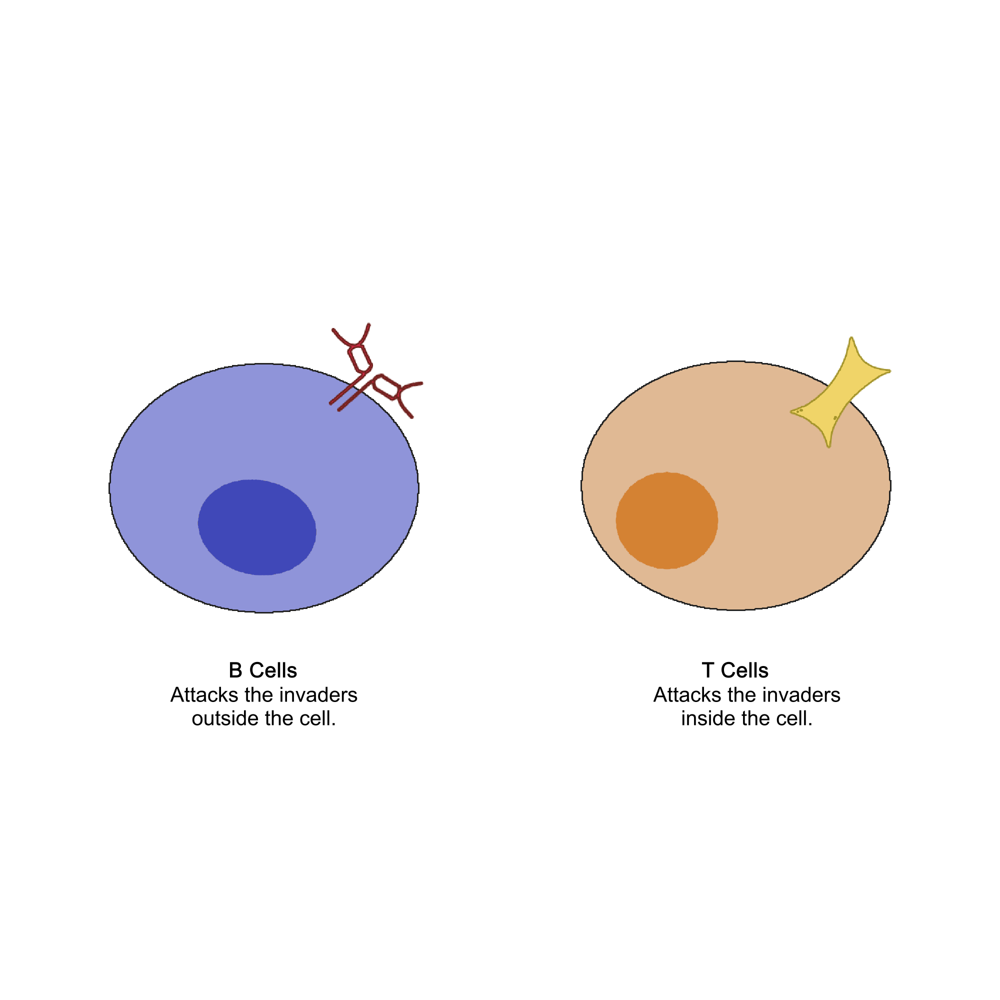
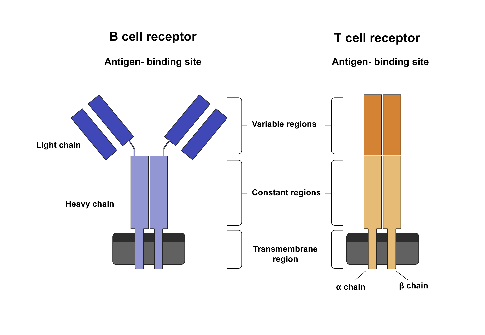
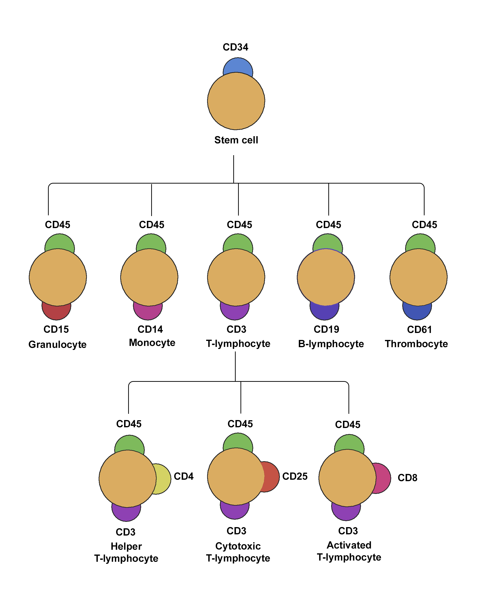

### Theory 
 
B-cells and T-cells are major peripheral blood lymphocytes that circulate in the blood and are some of the most important white blood cells that play a crucial role in the immune system. The maturation of B and T cells occurs in the primary lymphoid organs like the bone marrow and thymus, respectively. These cells work in collaboration to recognize and destroy foreign antigens. If the function of these cells goes haywire, the organism becomes more susceptible to diseases and cancer. 

B-cell receptors (BCR) and T-cell receptors (TCR) possess inherent structural features that provide their antigen binding specificity. The adaptive immunity depends on the hypervariability of these receptors . This diversity results from recombination in the genes that encode them. B-Cells are capable of recognizing free, unprocessed antigens whereas T-cells recognize antigens processed and complexed with cell surface proteins called major histocompatibility complex (MHC) on surface of antigens presenting cells. On recognizing the foreign antigen, the cells possessing the receptor starts to proliferate, increasing their numbers and amplifying the immune response in a process known as 'Clonal Expansion'. These newly made cells mostly dies off after the destruction of antigen but some live on to become memory B or T cells . These memory cells responds faster when the same antigen is encountered again.
 

 <b>T Cells structure and function</b> 

T cell receptors (TCRs) are composed of two polypeptide chains, forming a single antigen binding region. Approximately 95% of TCRs are made up of alpha and beta polypeptide chains, whereas a few possess gamma and delta chains. These chains are glycosylated and are held together by an inter-chain disulphide bond. The extracellular region of each chain has two domains which resemble immunoglobulin varuable and constant domains. The key structural features of TCRs are Complementary Binding Regions (CDRs) that lie within the variable region and provides antigen binding specificity . The T cell receptors are expressed normally on the surface of the T cells in association with some transmembrane co-receptor molecules . These molecules are either CD4+ or CD8+, both memeber belonging to the Ig superfamily. CD4 selectively binds to MHC class II molecules and CD8 MHC class I molecules inducing signal transduction after antigen binds TCR. The activated CD4+ T cells becomes helper T cells, secreting cytokines that regulate various other cell types like B cells, macrophages and other T cel types. CD8+ T cells on the other hand become cytotoxic T cells, capable of killing infected cells through perforin and granzyme meditiated pathways.

 <b>B cell structure and function</b> 

B cell receptor (BCR) is majorly composed of the membrane immunoglobulin (mIg) molecules and is mostly associated with Igα/Igβ heterodimers. The immunoglobulin molecules consists of two light and two heavy chains polypeptides. Each Ig molecules contains two antigen binding regions. The heavy chains are classified as IgM, IgG, IgE, IgD or IgE isotypes whereas the light chains are either kappa or lambda. The mIg results in receptor aggregation on antigen binding and Igα/Igβ heterodimer transduce signals to the cell interior. B cells can be activated either in T cell dependent pathway or T cell independent pathway. In T cell dependent activation, the antigen is absorbed by the B cell and antigen is presented in fragments via Major Histocompatibility Complex (MHC). The helper T cells (T H cells) recognize these antigens and further activate the B cell which starts expressing receptors for various cytokines such as IL-2, IL-4, and IL-5, released from T H cells. These cytokines further supports the differentiation of the B cells into antibody secreting plasma cells and memory B- cells. Antibodies tag the foreign antigens and target its clearance by other immune cells like macrophages. In T cell independent pathway, B cells are activated without the direct participation of the T cells. The response to these thymus independent antigens primarily involves IgM and generally do not give rise to memory (1).

  
 